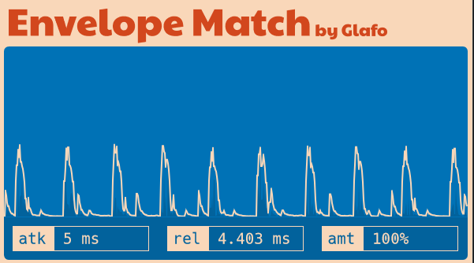

# Envelope Match

Envelope Match is a simple open-source envelope follower plug-ins that I made because I couldn't really find one that satisfied my needs. 

It is still a WIP. I will soon release the installers and binaries. For the moment, you can compile it from source on Windows using the Projucer. 

## Usage

In your DAW, use the effect on the track that you want to **modulate**. Then, connect to the sidechain input the track that you want to use as **modulator**. 

You can use the `amt` parameter to change the effect amount, and the `atk` and `rel` parameters to change attack and release.

---

## To-do

* Release VST and AU binaries for Mac, Windows and Linux
* Improve slider sensitivity

---

## License

`envelope-match` is [GPLv3 licensed](https://github.com/glafiro/envelope-match/blob/main/LICENSE).
